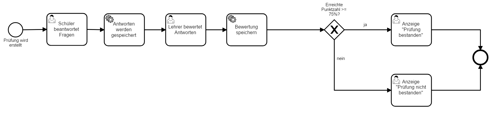

# Camunda

In diesem Beispiel geht es darum mithilfe von Camunda TODO in die tat umsetzen

## BPMN für dieses Beispiel



Im ersten Formular gibt der Lehrer den Namen des Schülers eingeben.
Als nächstes erhält der Schüler eine Prüfung mit bei der er eigene Antworten formulieren muss. 
Danach kann der Lehrer die Antworten des Schülers mit seinen Lösungen vergleichen und 0 bis 4 Punkte pro Antwort vergeben.
Im nächsten Schritt berechnet ein Script ob der Schüler mindestens 75% der maximalen Punktzahl erreicht hat.
Beim Gateway wird entschieden ob der Schüler sein Zertifikat erhält oder ob er eine Mittelung erhält die im mitteilt das er die Prüfung leider nicht bestanden hat.

## Model Class

Die Daten der Prüfung werden in einer Class abgespeichert:

```java
public class CustomerData {

	protected String answer1;
	protected String answer2;
	protected String answer3;
	protected int answer1points;
	protected int answer2points;
	protected int answer3points;
	protected String name;

  // ... getters / setters omitted
}
```

## Objektvariable aus Prozessinstanz erstellen und binden

Die Prozessinstanz wird mit einer Form gestarted. Diese besteht aus HTML und JavaScript, welches mit Angular erweitert ist, dass innerhalb der Camunda Tasklist angezeigt wird.

```html
<form name="customerForm" role="form">

  <script cam-script type="text/form-script">
    camForm.on('form-loaded', function() {
      // fetch the variable named 'customerData'
      camForm.variableManager.fetchVariable('customerData');
    });
    camForm.on('variables-fetched', function() {
      // after the variables are fetched, bind the value of customerData to a angular
      // scope value such that the form can work on it
      $scope.customerData = camForm.variableManager.variable('customerData').value;
    });
    var variableManager = camForm.variableManager;
    camForm.on('submit', function() {
      // this callback is executed when the form is submitted, *before* the submit request to
      // the server is executed
    });
  
  </script>

  <h3>BPMN Basic Check</h3>
  <div class="control-group">
    <label class="control-label" for="answer1">Was ist ein Nomen?</label>
    <div class="controls">
      <input id="answer1"
             class="form-control"
             type="text"
             required 
             ng-model="customerData.answer1">
    </div>
  </div>

  <div class="control-group">
    <label class="control-label" for="answer2">Was ist ein Verb?</label>
    <div class="controls">
      <input id="answer2"
             class="form-control"
             type="text"
             required
             ng-model="customerData.answer2">
    </div>
  </div>
  
    <div class="control-group">
    <label class="control-label" for="answer3">Was ist ein Adjektiv?</label>
    <div class="controls">
      <input id="answer3"
             class="form-control"
             type="text"
             required
             ng-model="customerData.answer3">
    </div>
  </div>
</form>
```

Das benutzerdefinierte JavaScript erstellt ein JavaScript-Objekt und bindet es an den `$scope` von Angular. Dann wird die Prozessvariable `customerData` erstellt und weitere Daten zum Datentyp und zur Serialisierung mitgegeben. Das Objekt soll schlussendlich als JSOn serialisiert werden und von Typ`org.camunda.bpm.example.usertask.embedded.serialized.model.CustomerData` sein.

Dass die Form an Angular gebunden ist, kann durch das `ng-model` Attribut eines Elements.


## Im Java-Code mit der Objektvariable arbeiten

In einem Java Delegate kann auf die `customerData` Variable und deren Eigenschaften zugegriffen werden:

```java

public class CalculateRating implements JavaDelegate {

  public void execute(DelegateExecution execution) throws Exception {

    CustomerData customerData = (CustomerData) execution.getVariable("customerData");

    // ...
  }
}
```

## Aus einer Task Form auf die Objektvariable zugreifen

In einer Task Form kann auf existierende Objektvariablen über JavaScript zugegriffen werden. Dabei werden die Werte auch direkt an den Angular `$scope` gebunden:


```html
<form name="customerForm" role="form">

  <script cam-script type="text/form-script">
    camForm.on('form-loaded', function() {
      // fetch the variable named 'customerData'
      camForm.variableManager.fetchVariable('customerData');
    });
    camForm.on('variables-fetched', function() {
      // after the variables are fetched, bind the value of customerData to a angular
      // scope value such that the form can work on it
      $scope.customerData = camForm.variableManager.variables["customerData"].value;
    });
  </script>

  Du hast <span id="answer1pointsDisplay" ng-model="customerData.answer1points">{{customerData.answer1points + customerData.answer2points + customerData.answer3points}}</span> von 12 möglichen Punkten erreicht.

</form>
```

## Installieren und Starten

1. [Camunda herunterladen](http://camunda.org/download)
2. Dieses Repsoitory herunterladen resp. clonen
3. Eclipse starten und das Projekt öffnen
4. Rechtsklick auf die `pom.xml` -> Run As -> Maven install in Eclipse
5. Die `.war` Datei in das Verzeichnis `target/` auf dem Server hochladen
6. Den Apache Tomcat server für Camunda starten
6. Camunda öffnen [http://localhost:8080/camunda/app/tasklist](http://localhost:8080/camunda/app/tasklist)
7. Eine neue Prozessinstanz erstellen


